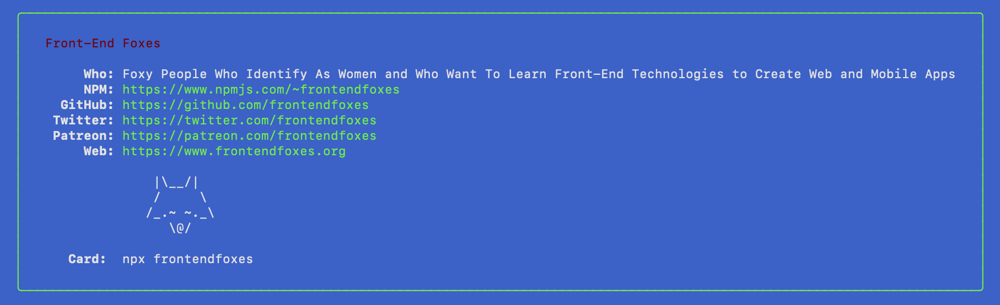

# My NPM Business Card

Shows my NPM card in the terminal.



## Try it

```sh
$ npx frontendfoxes
```

## Create your own

Use the [npmcard](https://www.npmjs.com/package/npmcard) library.

```sh
$ npm install npmcard
```

## Run locally

```sh
$npm run dev
```

Thank you to @bitandbang and @ovhemerg
